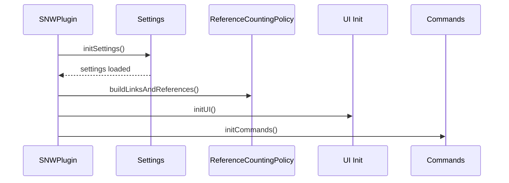
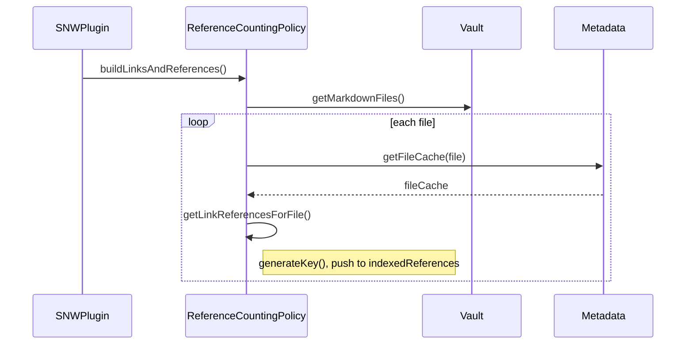
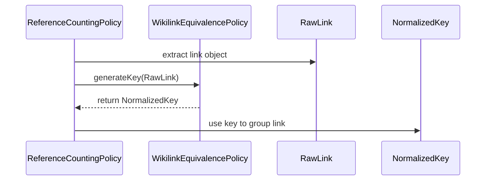
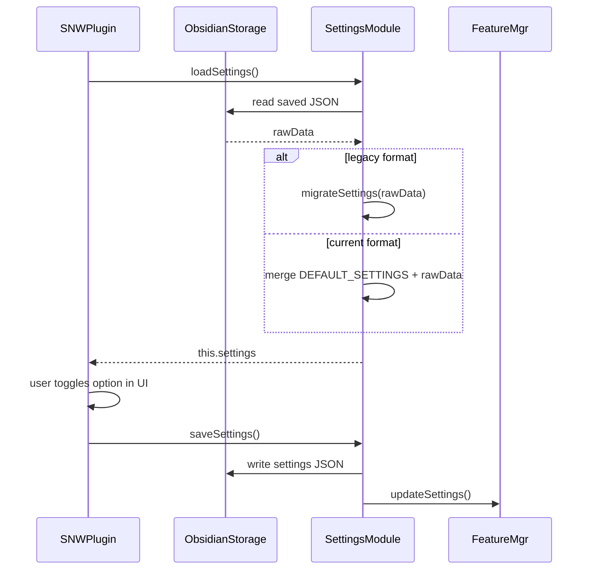
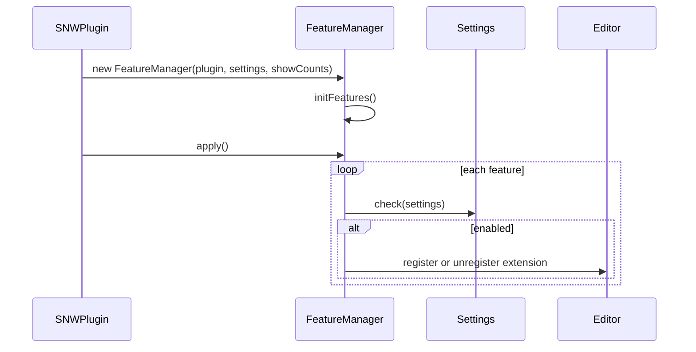
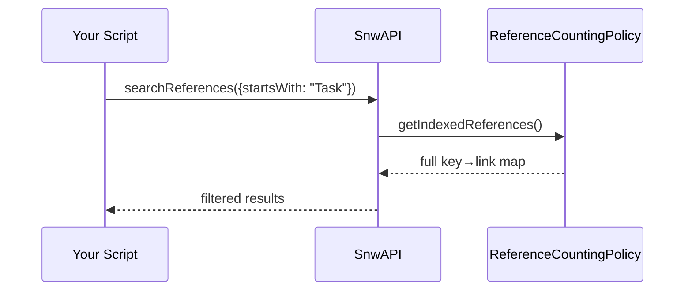
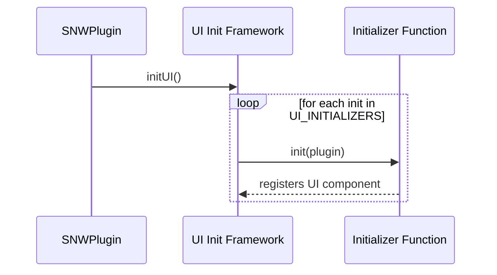
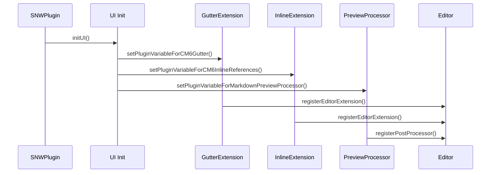

# Chapter 0: SNWPlugin

Welcome to the first chapter! In this chapter, we'll meet **SNWPlugin**, the heart of *Strange New Worlds*. Imagine a friendly conductor who brings together musicians, sheet music, and the stage crew—to deliver a beautiful performance. **SNWPlugin** is that conductor for your Obsidian vault.

## Why SNWPlugin Matters

When you install the plugin, you don't manually call any methods. Instead, **SNWPlugin** hooks into Obsidian's startup, loads your preferences, sets up visual features, and makes everything run smoothly:

- **Load your settings** so the plugin behaves as you like  
- **Initialize UI components** (inline counters, gutters, sidepane)  
- **Build the reference index** to know how often links appear  
- **Register commands and API** so you can script or rebuild the index  

By understanding SNWPlugin, you'll know exactly how all parts of the plugin come together!

---

## Core Use Case

> **Use case:** You open Obsidian and want to see little counters next to links showing how many times you link to each note.  
>
> Under the hood: SNWPlugin coordinates everything so that as you browse or edit, counts update seamlessly.

---

## Key Concepts

1. **Plugin Lifecycle**  
   - `onload()` runs when the plugin starts  
   - `onunload()` cleans up when the plugin is disabled  

2. **Initialization Sequence**  
   - Load settings → Build index → Init UI → Init features → Register commands  

3. **Debounced Events**  
   - Changes (file rename, metadata update) trigger index rebuilds—but *debounced* to avoid slowdowns  

---

## How to Use SNWPlugin

You don't write code—just enable the plugin! But here's a peek at the **onload** method, split into bite‑size pieces:

```ts
// src/main.ts (snippet)
export default class SNWPlugin extends Plugin {
  async onload(): Promise<void> {
    console.log(`loading ${this.manifest.name}`);
    
    // 1. Load user settings
    await this.initSettings();
    // 2. Build the reference index
    this.referenceCountingPolicy.buildLinksAndReferences();
    
    // 3. Set up UI, commands, debounce handlers...
    await this.initUI();
    await this.initCommands();
    // ...
  }
}
```

> **What happens here?**  
> - **Line 3:** Obsidian calls `onload()` automatically when starting.  
> - **Line 6:** We load and apply your settings.  
> - **Line 8:** We build the initial index of all wikilinks.  
> - **Lines 11–12:** We wire up UI components and commands.

---

## Under the Hood: Startup Flow

Let's visualize the startup steps with a mermaid sequence diagram:



1. **initSettings()** reads and applies your preferences.  
2. **buildLinksAndReferences()** scans your files and counts links.  
3. **initUI()** registers popovers, gutters, and inline counters.  
4. **initCommands()** adds "Rebuild references" command to the palette.

---

## A Deeper Look at initUI()

Here's how SNWPlugin loops through UI initializers:

```ts
private async initUI(): Promise<void> {
  for (const init of this.UI_INITIALIZERS) {
    init(this); // call each setup function
  }
}
```

- **`UI_INITIALIZERS`** is an array of functions from `src/ui/ui-inits.ts`.  
- Each function takes the plugin instance and wires one piece of the UI (e.g., gutters, live preview, etc.).

> **Analogy:** Think of `UI_INITIALIZERS` as a row of stagehands, each responsible for setting up lights, sound, props, and seats—one after another.

---

## Conclusion & Next Steps

You've learned how **SNWPlugin**:

- Hooks into Obsidian's startup  
- Loads settings and builds the reference index  
- Initializes UI features and commands  

Next, we'll dive into the **ReferenceCountingPolicy**, which does the heavy lifting of scanning your vault and counting links.


# Chapter 1: ReferenceCountingPolicy

In [Chapter 0: SNWPlugin](#chapter-0-snwplugin), we saw how **SNWPlugin** orchestrates startup and kicks off the reference index. Now let's dive into the heart of that indexer: **ReferenceCountingPolicy**.

## Why ReferenceCountingPolicy Matters

> **Use case:** You click on a link like `[[Project]]` and want to see "3" next to it—showing you've linked to that note three times.  
>
> **ReferenceCountingPolicy** is the component that scans your vault, groups each link by a normalization policy, and counts how many times each appears. It's like a librarian who walks through every shelf, notes every book reference, then tallies them by title.

---

## Key Concepts

1. **indexedReferences**  
   A `Map<string, Link[]>` that stores each reference key (normalized link text) and an array of its occurrences.

2. **buildLinksAndReferences()**  
   Clears the old index and rebuilds it by scanning every Markdown file in the vault.

3. **getLinkReferencesForFile()**  
   Parses one file's metadata cache, generates keys via the active policy, and appends each link to `indexedReferences`.

---

## How to Use ReferenceCountingPolicy

You rarely call this yourself—**SNWPlugin** does it for you—but here's how it works under the hood:

```ts
// src/policies/reference-counting.ts
class ReferenceCountingPolicy {
  indexedReferences = new Map<string, Link[]>();

  buildLinksAndReferences(): void {
    this.indexedReferences.clear();
    // Loop through every markdown file
    for (const file of this.plugin.app.vault.getMarkdownFiles()) {
      const cache = this.plugin.app.metadataCache.getFileCache(file);
      this.getLinkReferencesForFile(file, cache);
    }
  }
}
```

> **Explanation:**  
> - **Line 4:** Reset all counts.  
> - **Line 6–8:** For each file, fetch its metadata and delegate to `getLinkReferencesForFile`.

```ts
// src/policies/reference-counting.ts
getLinkReferencesForFile(file: TFile, cache: CachedMetadata) {
  for (const link of cache.links ?? []) {
    const key = this.activePolicy.generateKey(link);
    if (!this.indexedReferences.has(key)) {
      this.indexedReferences.set(key, []);
    }
    this.indexedReferences.get(key)!.push({ file, link });
  }
}
```

> **Explanation:**  
> - **Line 2:** Loop over every link in the file.  
> - **Line 3:** Normalize it via the active `WikilinkEquivalencePolicy`.  
> - **Lines 4–7:** Store it under its key in the map.

---

## Under the Hood: Indexing Flow



1. **SNWPlugin** calls `buildLinksAndReferences()`.  
2. **ReferenceCountingPolicy** fetches all Markdown files.  
3. For each file:  
   - Retrieves its metadata cache  
   - Parses each link  
   - Normalizes via `generateKey()`  
   - Appends to `indexedReferences`

---

## Conclusion & Next Steps

You've learned how **ReferenceCountingPolicy**:

- Scans every file  
- Applies the active equivalence policy to each link  
- Builds a map of keys → occurrences  

Next, we'll explore those normalization rules in detail with **WikilinkEquivalencePolicy**.

# Chapter 2: WikilinkEquivalencePolicy

In [Chapter 1: ReferenceCountingPolicy](#chapter-1-referencecountingpolicy), we saw how links get collected and counted. Now let's dig into **WikilinkEquivalencePolicy**, the rules that decide when two links "mean the same thing."

## Why WikilinkEquivalencePolicy Matters

> **Use case:** You have notes `[[Color Theory]]` and `[[colour theory]]`. You want them counted as one reference, not two.  
>
> **WikilinkEquivalencePolicy** defines the "translation rules" that normalize link text so ReferenceCountingPolicy groups variants together—just like a team of translators agreeing that "colour" and "color" are the same word.

---

## Key Concepts

1. **Policy Interface**  
   Every policy implements:
   ```ts
   interface WikilinkEquivalencePolicy {
     name: string;                    // e.g. "Case Insensitive"
     generateKey(link: Link): string; // normalization logic
     isAsync?(): boolean;             // true for async policies
     generateKeyAsync?(link: Link): Promise<string>; // async version
   }
   ```
   This interface ensures each policy can produce a consistent key for any link.

   > **Note:** The policy system has been modularized. Each policy is now in its own file under `src/policies/policies/` for better maintainability. See [Policy System Documentation](../POLICY_SYSTEM.md) for details.

2. **Built‑in Policies**  
   - **Case Insensitive**: Upper‑cases everything  
   - **Same File**: Includes source file path to treat same‑file links uniquely  
   - **Word Form**: Strips common suffixes (`s`, `ing`, `ness`)  
   - **Base Name**: Drops path and extension, leaving just the filename  

3. **Active Policy**  
   ReferenceCountingPolicy holds an `activePolicy` and calls `activePolicy.generateKey(link)` for every link.

---

## How to Use WikilinkEquivalencePolicy

You configure which policy to use in settings (Chapter 3), but here's how a policy looks:

```ts
// src/policies/policies/CaseInsensitivePolicy.ts
import { AbstractWikilinkEquivalencePolicy } from "../base/WikilinkEquivalencePolicy";
import { normalizeBase } from "../linkKeyUtils";
import { Link } from "../../types";

export class CaseInsensitivePolicy extends AbstractWikilinkEquivalencePolicy {
  name = "Case Insensitive";
  generateKey(link: Link): string { 
    return normalizeBase(link); 
  }
}
```

> **What this does:**  
> - Takes the link's file path (or raw text)  
> - Converts to uppercase so `Note`, `note`, and `NOTE` share the same key.

---

## Under the Hood: Normalization Flow



1. **ReferenceCountingPolicy** hands each link to the active policy.  
2. **WikilinkEquivalencePolicy** applies its rule (e.g., uppercase).  
3. **ReferenceCountingPolicy** receives the normalized key and stores the link under it.

---

## A Deeper Look: Multiple Policies

Let's compare two policies with examples:

```ts
// WordFormPolicy: strips common suffixes
class WordFormPolicy implements WikilinkEquivalencePolicy {
  name = "Word Form";
  generateKey(link: Link): string {
    const base = link.reference.link.split('/').pop() || "";
    return base
      .toLowerCase()
      .replace(/(s|es|ing|ed|ness|ity)$/, '');
  }
}
```

- **Input:** `["[[Running]]", "[[Run]]", "[[Runs]]"]`  
- **Output Key:** `"run"`

```ts
// BaseNamePolicy: filename only, no extension
class BaseNamePolicy implements WikilinkEquivalencePolicy {
  name = "Base Name";
  generateKey(link: Link): string {
    const path = link.resolvedFile?.path || link.reference.link;
    const file = path.split('/').pop() || "";
    return file.replace(/\.\w+$/, '').toUpperCase();
  }
}
```

- **Input:** `["docs/Note.md", "note"]`  
- **Output Key:** `"NOTE"`

---

## Conclusion & Next Steps

You've learned how **WikilinkEquivalencePolicy**:

- Defines a standard interface for normalization  
- Offers multiple built‑in policies (case, word‑form, base name, same file)  
- Integrates with ReferenceCountingPolicy via `generateKey()`

Next, we'll see how you control which policy is active in **Chapter 3: Settings**.

# Chapter 3: Settings

In [Chapter 2: WikilinkEquivalencePolicy](#chapter-2-wikilinkequivalencepolicy), we learned how links get normalized before counting. Now let's see **how you tell the plugin which rules, thresholds, and displays you prefer**.

## Why Settings Matters

> **Use case:** You want to **turn off inline counters in source mode** and **pick "Word Form"** normalization so plurals don't split your counts.  
>
> The **Settings** module is your control panel—loading your choices when the plugin starts, migrating old formats, and saving updates when you tweak options.

---

## Key Concepts

1. **DEFAULT_SETTINGS**  
   A JavaScript object defining sensible defaults for every option (toggles, thresholds, policy choice).

2. **loadSettings()**  
   Reads stored data from Obsidian's storage, migrates legacy formats, and merges with defaults.

3. **saveSettings()**  
   Writes your current settings back to storage and notifies other components of changes.

4. **migrateSettings()**  
   Converts old version formats into the current `Settings` shape, so upgrades don't break your setup.

---

## How to Use Settings

You interact with Settings through the **Settings Tab** UI in Obsidian (⚙️ → Community Plugins → Strange New Worlds). Behind the scenes, here's what happens.

### Loading Settings on Startup

```ts
// src/main.ts (inside SNWPlugin.initSettings)
await this.loadSettings();
// If legacy format detected, migrate:
if (loadedData.enableOnStartupDesktop !== undefined) {
  this.settings = migrateSettings(loadedData as LegacySettings);
} else {
  this.settings = Object.assign({}, DEFAULT_SETTINGS, loadedData);
}
```

> **Explanation:**  
> 1. **loadData()** fetches saved JSON.  
> 2. If old keys exist, **migrateSettings()** reshapes them.  
> 3. Otherwise, merge saved values onto **DEFAULT_SETTINGS** so missing fields get defaults.

### Saving Settings When Changed

```ts
// src/main.ts
async saveSettings(): Promise<void> {
  await this.saveData(this.settings);
  this.featureManager.updateSettings(this.settings);
}
```

> **Explanation:**  
> - **saveData()** persists the full `settings` object.  
> - **updateSettings()** tells other components (like FeatureManager) to reapply toggles.

---

## Under the Hood: Settings Flow



1. **loadSettings()** retrieves and normalizes your data.  
2. **migrateSettings()** handles old layouts.  
3. **saveSettings()** persists new choices and notifies features.

---

## Example: Changing the Policy

Imagine you switch to **Word Form** normalization in the Settings Tab. The code flow:

1. **UI** updates `this.settings.wikilinkEquivalencePolicy = "word-form"`.  
2. **saveSettings()** writes the change.  
3. **ReferenceCountingPolicy.setActivePolicy("word-form")** runs on reload or via `this.referenceCountingPolicy.setActivePolicy(...)`.  
4. Your next rebuild uses `WordFormPolicy.generateKey()`.

---

## Conclusion & Next Steps

Now you know how **Settings**:

- Loads defaults  
- Upgrades old versions  
- Saves your preferences  

In the next chapter, we'll see how **FeatureManager** uses these settings to turn individual plugin features on or off.


# Chapter 4: FeatureManager

In [Chapter 3: Settings](#chapter-3-settings), you learned how your preferences get loaded and saved. Now let's see **FeatureManager**, the component that **turns individual features on or off** based on those settings.

## Why FeatureManager Matters

> **Use case:** You want **inline counters in live preview** but **no gutter badges**.  
>
> **FeatureManager** reads your settings and the global "show counts" flag, then **registers** or **unregisters** the right editor extensions and Markdown post‑processors—like a stage manager deciding which spotlights to switch on or off.

---

## Key Concepts

1. **Feature Interface**  
   ```ts
   interface Feature {
     name: string;                  
     check: (settings: Settings) => boolean; 
     register: () => void;           
     unregister: () => void;         
   }
   ```
   Each feature has a **name**, a **check** that returns enabled/disabled, and methods to **register** or **unregister**.

2. **initFeatures()**  
   Builds an array of features (markdownPreview, livePreview, gutter) with their checks and register/unregister logic.

3. **apply()**  
   Loops over every feature and calls either `feature.register()` or `feature.unregister()` depending on `feature.check(settings) && showCountsActive`.

4. **updateSettings() / updateShowCountsActive()**  
   Whenever settings change or the user toggles "show counts," FeatureManager reapplies all toggles.

---

## How to Use FeatureManager

You don't call it directly—SNWPlugin does that for you. But here's a peek at `apply()`:

```ts
// src/FeatureManager.ts
public apply(): void {
  for (const feature of this.features) {
    const enabled = feature.check(this.settings) && this.showCountsActive;
    if (enabled) {
      feature.register();
    } else {
      feature.unregister();
    }
  }
}
```

> **What this does:**  
> - **Line 3:** Checks if each feature is enabled.  
> - **Lines 4–7:** Registers or unregisters accordingly.

---

## Under the Hood: Toggling Flow



1. **SNWPlugin** constructs FeatureManager after loading settings.  
2. **initFeatures()** defines each feature's logic.  
3. **apply()** checks every feature and registers/unregisters it.

---

## Example: Toggling Gutter Badges

The "gutter" feature shows counts in the editor margin:

```ts
// inside initFeatures()
{
  name: "gutter",
  check: (s) => Platform.isMobile ? s.embed.referencesInGutterMobile : s.embed.referencesInGutter,
  register: () => this.updateCMExtensionState("gutter", true, ReferenceGutterExtension),
  unregister: () => this.updateCMExtensionState("gutter", false, ReferenceGutterExtension)
}
```

- **check:** Reads the appropriate setting (mobile vs. desktop).  
- **register/unregister:** Calls `updateCMExtensionState` to add or remove the CodeMirror extension.

---

## Conclusion & Next Steps

You now know how **FeatureManager**:

- Defines and checks each feature  
- Registers or unregisters extensions based on settings  
- Responds to setting changes and global toggles  

Next, we'll explore **SnwAPI**, which exposes reference data to scripts and templates.

# Chapter 5: SnwAPI

In [Chapter 4: FeatureManager](#chapter-4-featuremanager), we saw how features get toggled on and off. Now let's meet **SnwAPI**, the friendly concierge that lets you tap into reference data from scripts, templates, and the console.

## Why SnwAPI Matters

> **Use case:** You're building a DataviewJS snippet or a Templater command and want to **search for all keys starting with "Project"** or fetch metadata for the current file.  
>
> **SnwAPI** exposes methods like `searchReferences` and `getMetaInfoByCurrentFile` on `window.snwAPI`, so you don't have to dig into internal classes—just call the API!

---

## Key Concepts

1. **Global Attachment**  
   ```ts
   window.snwAPI = this.snwAPI;
   ```
   SNWPlugin attaches one instance of `SnwAPI` to the global `window`, making it easy to call from anywhere.

2. **searchReferences(options)**  
   - **options.startsWith**: find keys beginning with a string  
   - **options.contains**: find keys containing a substring  
   Returns an array of `[key, occurrences]`.

3. **getMetaInfoByCurrentFile()**  
   Returns the active file's `TFile`, its metadata cache, and the plugin's transformed SNW cache.

4. **parseLinkTextToFullPath(linkText)**  
   Converts a raw link (like `"Note/Subnote"`) into the full vault path, matching Obsidian's resolution logic.

---

## How to Use SnwAPI

You can run these in the developer console or in a DataviewJS code block:

```js
// Find all keys starting with "Project"
const results = await window.snwAPI.searchReferences({ startsWith: "Project" });
console.log("Matches:", results);
```

> **What happens?**  
> - Calls `searchReferences` on the global API  
> - Logs an array of matching keys and their reference arrays

```js
// Get metadata for the current file
const info = await window.snwAPI.getMetaInfoByCurrentFile();
console.log("Current file info:", info);
```

> **What happens?**  
> - Resolves the active file's `TFile` and metadata  
> - Provides the SNW-transformed cache (link counts) for this file

---

## Under the Hood: API Flow



1. Your script calls `searchReferences(...)`.  
2. **SnwAPI** pulls the full index from `ReferenceCountingPolicy`.  
3. It filters keys per your options and returns matches.

---

## Example: Parsing a Link

```js
// Convert a link text to full path
const fullPath = window.snwAPI.parseLinkTextToFullPath("Notes/Ideas");
console.log(fullPath);
// → e.g. "Notes/Ideas.md"
```

> **What happens?**  
> - Calls into `ReferenceCountingPolicy.parseLinkTextToFullPath()`  
> - Returns the resolved file path, letting you open or link to it programmatically

---

## Conclusion & Next Steps

You've learned how **SnwAPI**:

- Attaches to `window` for easy access  
- Provides `searchReferences`, `getMetaInfoByCurrentFile`, and `parseLinkTextToFullPath`  
- Shields you from digging into internal classes  

Next, we'll explore **UI Initialization Framework**, where we register all the UI pieces that render counters and previews.

# Chapter 6: UI Initialization Framework

In [Chapter 5: SnwAPI](#chapter-5-snwapi), we saw how scripts and templates access reference data. Next, we'll explore **UI Initialization Framework**, the part that **wires up every visual feature** so you see counters, popovers, and gutters in your editor.

## Why UI Initialization Matters

> **Use case:** When you open a note, you want SNW to automatically attach little counters next to links, add gutter badges, and set up popover previews—*without writing any code*.  
>
> The **UI Initialization Framework** acts like a row of stagehands behind the scenes: each one sets up a specific UI piece so your plugin looks and feels complete.

---

## Key Concepts

1. **UI_INITIALIZERS Array**  
   A list of functions imported from `src/ui/ui-inits.ts`. Each function takes the plugin instance and registers one UI feature.
   
2. **initUI() Method**  
   In `SNWPlugin`, `initUI()` simply loops through `UI_INITIALIZERS` and calls each initializer in order.
   
3. **Individual Initializers**  
   Examples include:
   - **setPluginVariableUIC_RefArea**: Prepares the sidepane view  
   - **setPluginVariableForCM6Gutter**: Hooks gutter badge extension  
   - **setPluginVariableForMarkdownPreviewProcessor**: Adds popovers in preview mode  

---

## How to Use the Framework

You don't call individual initializers—SNWPlugin does it for you:

```ts
// src/main.ts
private async initUI(): Promise<void> {
  // Call each UI setup function in turn
  for (const init of this.UI_INITIALIZERS) {
    init(this);
  }
}
```

> **What's happening?**  
> - **Line 3:** SNWPlugin iterates over each function in `UI_INITIALIZERS`.  
> - **Line 4:** Calls the initializer with the plugin instance, giving it access to settings, API, and workspace.

---

### Example: UI_INITIALIZERS Definition

```ts
// src/ui/ui-inits.ts
export const UI_INITIALIZERS: Array<(plugin: SNWPlugin) => void> = [
  setPluginVariableUIC_RefArea,
  setPluginVariableForHtmlDecorations,
  setPluginVariableForCM6Gutter,
  setPluginVariableForHeaderRefCount,
  setPluginVariableForFrontmatterLinksRefCount,
  setPluginVariableForMarkdownPreviewProcessor,
  setPluginVariableForCM6InlineReferences,
  setPluginVariableForUIC,
  initDebouncedHelpers,
];
```

> **Explanation:** Each entry is a function that knows how to register a specific UI component—together they build your entire SNW UI.

---

## Under the Hood: Registration Flow



1. **SNWPlugin** calls `initUI()`.  
2. **UI Init Framework** loops through each initializer.  
3. Each **Initializer Function** hooks into Obsidian's API to set up its feature.

---

## Analogy

Think of **UI_INITIALIZERS** as a team of stagehands:

- One sets up the **paintings** (inline counters)  
- Another organizes the **curtains** (gutter badges)  
- A third arranges the **lighting** (popovers)  

When the show (your vault) opens, they all run on cue, ensuring every visual element is in place.

---

## Conclusion & Next Steps

You've learned how **UI Initialization Framework**:

- Holds a list of setup functions (`UI_INITIALIZERS`)  
- Uses `initUI()` to call each initializer in sequence  
- Registers every visual component without manual wiring  

Next, we'll dive deeper into those visual pieces in **Chapter 7: View Extensions**.

# Chapter 7: View Extensions

In [Chapter 6: UI Initialization Framework](#chapter-6-ui-initialization-framework), we saw how SNWPlugin calls a row of helpers to set up UI. Now let's explore those visual helpers themselves—**View Extensions**—the code that actually *paints* counters, popovers, and badges onto your notes.

## Why View Extensions Matter

> **Use case:** You open a Markdown file and see **inline counters** next to links, **gutter badges** showing counts in the margin, and **popover previews** when hovering a link.  
>
> **View Extensions** are the artists on stage: each one hooks into Obsidian's editor or preview renderer to draw these visual cues so you can instantly see and explore your reference network.

---

## Key Concepts

1. **CodeMirror Extensions**  
   - **ReferenceGutterExtension** adds count badges in the left gutter.  
   - **InlineReferenceExtension** highlights links and inserts inline counters in the editor.

2. **Markdown Post‑Processor**  
   - **referencesPreview** runs in preview mode to attach popover containers showing reference lists.

3. **Registration API**  
   - Editor extensions use `plugin.registerEditorExtension(...)`.  
   - Preview extensions use `plugin.registerMarkdownPostProcessor(...)`.

---

## How to Use View Extensions

You don't manually register these—the UI initializers do. But here's a peek at one:

```ts
// src/ui/ui-inits.ts
import ReferenceGutterExtension from "../view-extensions/gutters-cm6";

export function setPluginVariableForCM6Gutter(plugin: SNWPlugin) {
  // Register gutter badges in the editor
  plugin.registerEditorExtension(ReferenceGutterExtension);
}
```

> **Explanation:**  
> - We import the gutter extension function.  
> - `registerEditorExtension` tells Obsidian to run it whenever the editor loads a document.

And for popovers in preview:

```ts
// src/ui/ui-inits.ts
import markdownPreviewProcessor from "../view-extensions/references-preview";

export function setPluginVariableForMarkdownPreviewProcessor(plugin: SNWPlugin) {
  // Priority 100 ensures it runs after Markdown is rendered
  plugin.registerMarkdownPostProcessor(markdownPreviewProcessor, 100);
}
```

> **Explanation:**  
> - We import the preview‑mode processor.  
> - `registerMarkdownPostProcessor` injects our popover setup into each rendered paragraph.

---

## Under the Hood: Rendering Flow



1. **initUI()** calls each registration helper.  
2. **Gutter/Inline** extensions register with CodeMirror.  
3. **Preview** processor registers with Markdown renderer.  
4. The editor then *draws* counters and popovers on screen.

---

## Analogy

Think of **View Extensions** as decorators for a cake:

- The **gutter** extension pipes icing (badges) on the side.  
- The **inline** extension sprinkles mini‑candies (counters) atop links.  
- The **preview** extension adds a glass dome (popovers) you lift to peek inside.

All three work together to make your notes both beautiful and informative.

---

## Conclusion

You've now seen how **View Extensions**:

- Implement the visual features (gutter badges, inline counters, popovers)  
- Hook into Obsidian's editor and preview pipelines  
- Are registered automatically by the UI initialization framework  

🎉 **That wraps up our tutorial!** You now understand each core abstraction of **Strange New Worlds**—from the central plugin class to the settings, policies, features, API, UI wiring, and the view‑layer artists themselves. Happy exploring!